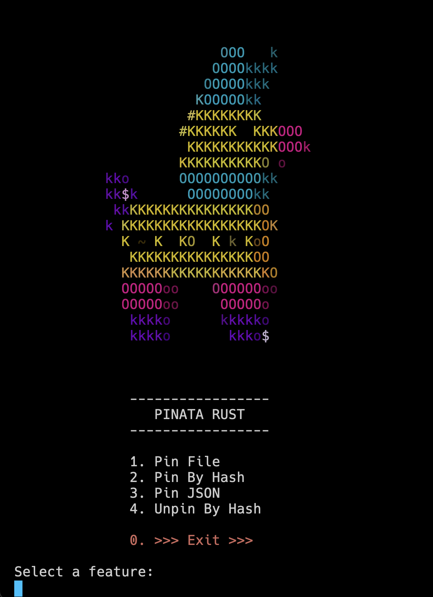

# pinata-rust

Pinata-Rust is a command-line tool that allows you to interact with the Pinata IPFS API. It provides functionality to pin files, pin IPFS content by hash, pin JSON data, and unpin content from Pinata's IPFS nodes.

## Getting Started

### Prerequisites

- Rust (https://www.rust-lang.org/tools/install)

### Installation

1. Clone the repository:

   ```shell
   git clone https://github.com/microdapps/pinata-rust.git
   ```

2. Environment variables:

You will need to create a Pinata account and generate API keys. You can do so here: https://pinata.cloud/keys. Once you have your API keys, you will need to set the following environment variables in a `.env` file on the root of the project:

```shell
export PINATA_API_KEY=<your-pinata-api-key>
export PINATA_API_SECRET=<your-pinata-secret-api-key>
```

3. Build the project:

   ```shell
    cargo build
   ```

4. Run the project:

   ```shell
    cargo run
   ```

## Usage



### Pin File

This option allows you to pin a file to Pinata's IPFS nodes. You can pin a file by providing a path to the file.

### Pin By Hash

This option allows you to pin IPFS content by hash. You can pin content by hash by providing a hash.

### Pin JSON

This option allows you to pin JSON data to Pinata's IPFS nodes. You can pin JSON data by providing the JSON data.

### Unpin

This option allows you to unpin content from Pinata's IPFS nodes. You can unpin content by providing a hash.
